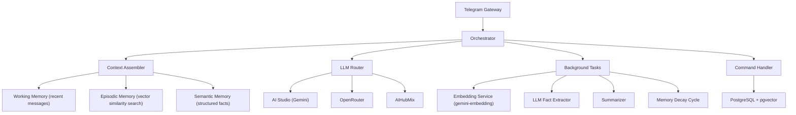

# 🧠 Remember Bot — A Memory-First AI Companion

[](https://t.me/rememberagentaibot)
[](https://python.org)
[](https://fastapi.tiangolo.com)
[](https://www.docker.com)

Welcome to **Remember Bot** (available in production at [t.me/rememberagentaibot](https://t.me/rememberagentaibot)), a next-generation personal assistant designed with an intelligent, persistent, multi-tiered memory system. 

Unlike conventional chatbots that forget everything when a conversation ends, Remember Bot retains structured facts, episodic interactions, and conversational summaries over time, allowing for incredibly natural, context-aware, and long-term personal pair-assistance.

---

## 🌟 Key Features

*   **Multi-Tiered Cognitive Memory**:
    *   **Working Memory**: Retains the immediate flow of your current conversation.
    *   **Episodic Memory**: Automatically embeds and indexes every message using high-dimensional vector embeddings (`pgvector` + `gemini-embedding`), offering semantic similarity retrieval of historical context.
    *   **Semantic Memory**: Continuously parses interactions in the background using LLMs to extract structured, tag-based facts about your life, preferences, and details.
*   **Multimodal Capabilities**:
    *   🎤 **Voice Messages**: Send voice notes naturally. The bot converts OGG/audio on-the-fly to WAV and processes them using Gemini's native multimodal audio understanding.
    *   📷 **Image Understanding**: Snap and upload photos with or without text captions to have the bot interpret their contents visually and integrate them into memory.
*   **Smart Memory Decay**: Real-world memory is dynamic. Stored facts undergo a configurable half-life decay. Facts that are not reinforced or referenced naturally fade and deactivate, keeping the agent's memory relevant and uncluttered.
*   **Token Budget Context Assembler**: Seamlessly aggregates the three memory tiers within API token budgets, preventing context overflow while optimizing prompt relevancy.
*   **Resilient Model Router**: Powered by a robust routing network supporting multiple providers (Google AI Studio, OpenRouter, AIhubmix) with automatic fallback chains in case of service disruptions.
*   **Complete Data Ownership**: Full user controls to inspect, search, partially forget, or completely export chat history and extracted facts at any time.

---

## 🚀 How to Use the Bot

You don't need any complex instructions or special commands to start using the bot. Just search for **[@rememberagentaibot](https://t.me/rememberagentaibot)** on Telegram, tap **/start**, and begin chatting!

### 💬 Chat Naturally
Talk to the bot just like a human friend or assistant:
*   *"I'm planning a trip to Italy next April."*
*   *"Remember that my dog's name is Barnaby."*
*   *"What was that trip I said I was planning?"* (The bot will query its episodic and semantic memory to recall Italy!)

### 🎤 Voice & 📷 Image Messages
*   **Voice notes**: Simply press the microphone icon in Telegram and record. The bot will listen, understand, reply, and remember!
*   **Photos**: Send an image. You can add a caption such as *"This is my new bicycle"* or ask *"What is written on this paper?"*

---

## ⚙️ Interactive Commands

Remember Bot provides a suite of slash commands so you have full control over what is stored, forgotten, or configured.

| Command | Description | Example / Usage |
|:---|:---|:---|
| `/facts` | Lists all structured facts currently remembered about you. | Displays fact IDs, tag associations, and contents. |
| `/search <query>` | Searches your active semantic facts using keyword and tag lookups. | `/search italy` |
| `/forget <id\|all>` | Deactivates a specific fact by its ID, or clears your entire memory. | `/forget 12` or `/forget all` |
| `/stats` | Shows detailed database and memory budget utilization stats. | `/stats` |
| `/export` | Generates a downloadable `.zip` containing your full chat history and facts in JSON and Markdown formats. | `/export` |
| `/model` | Displays the current AI models assigned to each task and their failover fallbacks. | `/model` |
| `/help` | Shows the command menu and a helpful usage reference. | `/help` |

---

## 🛠️ Architecture Overview

The system is designed with a highly modular pipeline that decouples the chat interface from the LLM processing and memory storage layers:



---

## 💻 Local Development & Deployment

To run your own instance of Remember Bot locally, follow the steps below.

### 📋 Prerequisites
*   [Docker](https://www.docker.com/) and [Docker Compose](https://docs.docker.com/compose/) installed.
*   A Telegram Bot Token (obtained from [@BotFather](https://t.me/BotFather)).
*   An API key from at least one supported AI Provider (e.g., [Google AI Studio](https://aistudio.google.com/)).
*   [Ngrok](https://ngrok.com/) or another tunneling service (for local webhook routing).

### 1. Clone & Set Up Configuration
1.  Clone the repository.
2.  Copy `.env.example` to `.env`:
    ```bash
    cp .env.example .env
    ```
3.  Edit `.env` and fill in your details:
    ```env
    # Database
    DATABASE_URL=postgresql+asyncpg://bot:botpass@db:5432/rememberbot

    # Telegram
    TELEGRAM_BOT_TOKEN=123456789:ABCdefGhIJKlmNoPQRsTUVwxyZ

    # Webhook Base URL (Your ngrok tunnel or production domain)
    WEBHOOK_BASE_URL=https://your-subdomain.ngrok-free.app

    # AI API Keys (at least one key must be set)
    AISTUDIO_API_KEY=AIzaSy...
    OPENROUTER_API_KEY=sk-or-...
    AIHUBMIX_API_KEY=sk-...
    ```

### 2. Configure Models and Memory Options
The bot relies on a `config.yaml` file in the root directory to customize LLM tasks, memory sizes, and decay settings. You can edit this file to configure:
*   Which LLM provider/model handles `chat`, `fact_extraction`, `summarization`, `embeddings`, and `vision`.
*   Memory budget constraints (e.g., maximum token counts, number of retrieved memories).
*   Relevance half-life decay variables.

### 3. Spin up with Docker Compose
Run the following command to build the Python application container and spin up a PostgreSQL instance with the `pgvector` extension:

```bash
docker compose up --build -d
```

On initial startup, FastAPI's lifecycle engine will automatically connect to the database and generate all necessary database tables and relations.

### 4. Setting up the Telegram Webhook (Local Dev)
For Telegram to send messages to your local instance, you must configure a secure webhook using a tunnel like `ngrok`:

1.  Start your local tunnel on the port defined in `docker-compose.yml` (default is `8522` mapped to `8000` inside the container):
    ```bash
    ngrok http 8522
    ```
2.  Copy the secure forwarding URL provided by ngrok (e.g., `https://xxxx-xx-xx-xx.ngrok-free.app`).
3.  Update the `WEBHOOK_BASE_URL` parameter in your `.env` file with this ngrok URL.
4.  Restart your Docker containers:
    ```bash
    docker compose down && docker compose up -d
    ```
5.  Check your container startup logs using `docker compose logs -f app` to verify that the webhook registered successfully with the Telegram API:
    ```text
    Telegram webhook set: https://xxxx-xx-xx-xx.ngrok-free.app/webhook/telegram
    ```

---

## 🔒 Security & Privacy

Remember Bot treats your data with maximum respect:
*   All communications with Telegram and LLM providers are encrypted via HTTPS.
*   Facts can be audited or scrubbed instantly via the `/facts` and `/forget` commands.
*   Your data is stored in your dedicated database instance.
*   The `/export` command exports everything we know about you in an open, portable ZIP archive containing structured JSON and markdown files.
