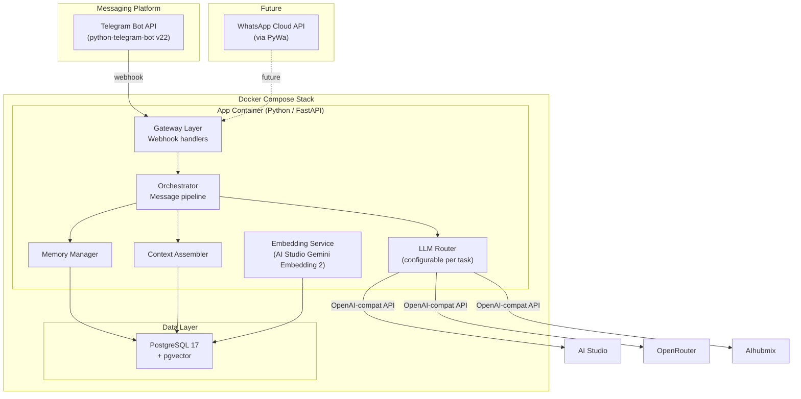
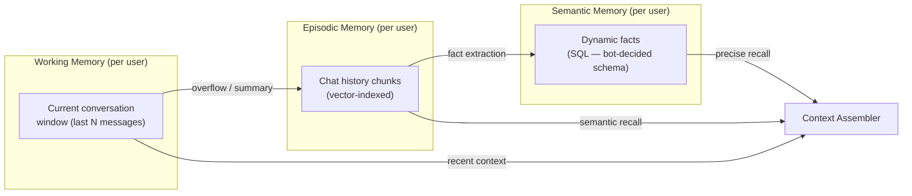
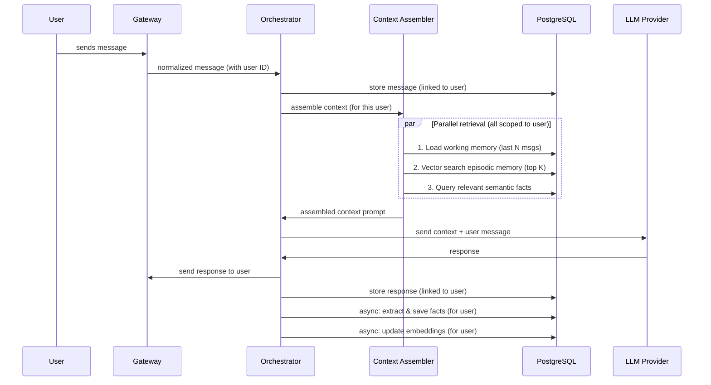
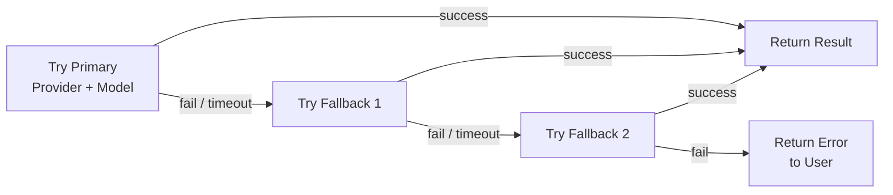

# Remember Bot — Architecture Plan

A memory-first chatbot with infinite context retention, delivered through Telegram (WhatsApp later), powered by configurable multi-provider AI, and deployed with a single `docker compose up`.

---

## High-Level Architecture



---

## 1. Technology Choices

| Layer | Technology | Rationale |
|:---|:---|:---|
| **Language** | Python 3.12 | Rich AI/ML ecosystem, async support |
| **Web Framework** | FastAPI | Async, webhook-friendly, lightweight |
| **Telegram** | [python-telegram-bot v22](https://python-telegram-bot.org/) | Mature async library, Telegram Bot API 9.5 |
| **WhatsApp** | [PyWa](https://pywa.readthedocs.io/) *(future)* | Leading Python wrapper for WhatsApp Cloud API |
| **SQL + Vector DB** | PostgreSQL 17 + pgvector | Single database for both structured data AND vector search — fewer moving parts |
| **ORM** | SQLAlchemy 2.0 + asyncpg | Async, pgvector support via `pgvector` Python package |
| **Embeddings** | AI Studio — **Gemini Embedding 2** (free tier) | Zero cost, high quality, 768 dimensions |
| **AI Providers** | OpenAI Python SDK pointed at different base URLs | All 3 providers expose OpenAI-compatible APIs |
| **Default chat model** | **Gemini 3.1 Flash Lite** via AI Studio | Free tier, fast, good quality for chat |
| **Containerization** | Docker Compose (2 services: `app` + `postgres`) | Simple deployment |

> [!IMPORTANT]
> **Why pgvector instead of a dedicated vector DB (Qdrant, Milvus)?**
> All data lives in one PostgreSQL instance — simplifies backups, reduces Docker services, and pgvector's HNSW indexing is production-grade for the scale this bot will reach. If it's ever outgrown, the vector layer can be swapped without touching the rest.

---

## 2. Memory Architecture — The Core Innovation

All memory is **stored and retrieved per user**. Each user (identified by Telegram user ID, or future WhatsApp phone/ID) has fully isolated memory — their facts, embeddings, and history are never mixed with other users'.



### 2.1 Working Memory (Short-term)

- The **last N messages** (configurable, e.g. 20) of the current conversation **for this user**.
- Stored in the `messages` SQL table and loaded directly into the LLM context.
- When the window exceeds a threshold, older messages are **summarized** and pushed to episodic memory.

### 2.2 Episodic Memory (Vector Store)

- **Every message** is embedded (via Gemini Embedding 2) and stored in `message_embeddings`, **scoped to the user**.
- **Conversation summaries** are generated periodically and also embedded.
- Retrieval: when the user sends a message, the Context Assembler performs a **cosine similarity search** within that user's embeddings to find the most relevant past conversations/messages.

### 2.3 Semantic Memory (Dynamic Facts)

The bot **autonomously decides** what to remember. There are no hardcoded fact categories — the LLM itself determines:

- **Whether** something is worth remembering
- **What** the fact is (in its own words)
- **How** to tag/categorize it (free-form tags, not a fixed enum)
- **Whether** it updates or contradicts a previously stored fact

The fact extraction prompt gives the LLM full freedom:

```
Analyze this conversation turn. Extract any information that would be valuable 
to remember about the user for future conversations. This could be anything: 
preferences, locations of objects, names of people, important dates, 
instructions for how to behave, technical details they've shared, opinions, 
goals, routines, health info, or anything else you judge to be worth persisting.

For each fact, provide:
- A concise fact statement
- Free-form tags (whatever categories make sense)
- Whether this updates/replaces a known fact (provide the old fact ID if so)
- A relevance score (how likely is this to be useful in future conversations)

If nothing in this turn is worth remembering, return an empty list.
```

Facts have **confidence scores**, **timestamps**, **free-form tags**, and **source message references**. When a fact contradicts an existing one, the old fact is versioned (not deleted) — preserving history.

> [!TIP]
> The fact extraction happens as a **background async task** after the response is sent, keeping the bot responsive. The user never waits for memory processing.

---

## 3. Context Assembly Pipeline

This is the critical path that prevents "context rot." On every incoming message:



### Context Budget Allocation

The assembled prompt follows a **budget-based** approach to fit within model token limits:

| Section | % of Budget | Content |
|:---|:---|:---|
| **System prompt** | ~10% | Bot personality, instructions, current date/time |
| **Semantic facts** | ~15% | Most relevant stored facts about this user |
| **Episodic recall** | ~25% | Semantically similar past conversation snippets |
| **Working memory** | ~40% | Recent conversation messages |
| **User message** | ~10% | The current message |

The assembler dynamically adjusts these percentages based on what's available (e.g., a new user has no facts, so working memory gets more space).

---

## 4. AI Provider System — Fully Configurable

All three providers are OpenAI-compatible, so they share a unified client. **Every task is independently configurable** — you choose which provider + model to use for each:

### Task-to-Provider Configuration

Stored in a config file (or `.env`), editable without redeploying:

```yaml
# config.yaml
llm:
  providers:
    aistudio:
      base_url: "https://generativelanguage.googleapis.com/v1beta/openai/"
      api_key_env: "AISTUDIO_API_KEY"
    openrouter:
      base_url: "https://openrouter.ai/api/v1"
      api_key_env: "OPENROUTER_API_KEY"
    aihubmix:
      base_url: "https://api.aihubmix.com/v1"
      api_key_env: "AIHUBMIX_API_KEY"

  tasks:
    chat:
      provider: "aistudio"
      model: "gemini-3.1-flash-lite"
      fallback:
        - provider: "openrouter"
          model: "google/gemini-2.0-flash-001"
        - provider: "aihubmix"
          model: "gpt-4o-mini"

    fact_extraction:
      provider: "aistudio"
      model: "gemini-3.1-flash-lite"
      fallback:
        - provider: "openrouter"
          model: "google/gemini-2.0-flash-001"

    summarization:
      provider: "aistudio"
      model: "gemini-3.1-flash-lite"
      fallback:
        - provider: "aihubmix"
          model: "gpt-4o-mini"

    embeddings:
      provider: "aistudio"
      model: "gemini-embedding-2"
      # No fallback — embeddings must use the same model for consistency

  fallback_enabled: true  # Global toggle for fallback chains
```

### Fallback Chain Logic

Every task that supports fallbacks follows this flow:



Fallback triggers: HTTP errors, timeouts (configurable, e.g. 30s), rate limits, invalid responses.

---

## 5. Database Schema

### Core Tables (PostgreSQL + pgvector)

All queries are scoped by `user_id` to ensure per-user data isolation.

```sql
-- Users (one per chat participant, identified by platform ID)
CREATE TABLE users (
    id              SERIAL PRIMARY KEY,
    platform        VARCHAR(10) NOT NULL,      -- 'telegram' | 'whatsapp'
    platform_user_id VARCHAR(64) NOT NULL,     -- Telegram user ID / WhatsApp phone
    display_name    VARCHAR(255),
    settings        JSONB DEFAULT '{}',        -- per-user config overrides
    created_at      TIMESTAMPTZ DEFAULT NOW(),
    UNIQUE(platform, platform_user_id)
);

-- Conversations (1:1 chats, scoped to user)
CREATE TABLE conversations (
    id              SERIAL PRIMARY KEY,
    user_id         INTEGER REFERENCES users(id) NOT NULL,
    platform        VARCHAR(10) NOT NULL,
    platform_chat_id VARCHAR(64) NOT NULL,
    created_at      TIMESTAMPTZ DEFAULT NOW(),
    UNIQUE(platform, platform_chat_id)
);

-- Messages (full chat history, linked to user)
CREATE TABLE messages (
    id              BIGSERIAL PRIMARY KEY,
    conversation_id INTEGER REFERENCES conversations(id),
    user_id         INTEGER REFERENCES users(id) NOT NULL,
    role            VARCHAR(10) NOT NULL,       -- 'user' | 'assistant'
    content         TEXT NOT NULL,
    metadata        JSONB DEFAULT '{}',         -- tokens, provider, model, latency
    created_at      TIMESTAMPTZ DEFAULT NOW()
);
CREATE INDEX idx_messages_conv_time ON messages(conversation_id, created_at DESC);
CREATE INDEX idx_messages_user ON messages(user_id, created_at DESC);

-- Message Embeddings (vector search for episodic memory, per user)
CREATE TABLE message_embeddings (
    id              BIGSERIAL PRIMARY KEY,
    message_id      BIGINT REFERENCES messages(id) ON DELETE CASCADE,
    user_id         INTEGER REFERENCES users(id) NOT NULL,
    chunk_text      TEXT NOT NULL,
    embedding       vector(768) NOT NULL,       -- Gemini Embedding 2 dimension
    created_at      TIMESTAMPTZ DEFAULT NOW()
);
CREATE INDEX idx_embeddings_user ON message_embeddings(user_id);
CREATE INDEX idx_embeddings_hnsw ON message_embeddings 
    USING hnsw (embedding vector_cosine_ops);

-- Dynamic Facts (semantic memory — bot decides what to store)
CREATE TABLE facts (
    id              SERIAL PRIMARY KEY,
    user_id         INTEGER REFERENCES users(id) NOT NULL,
    content         TEXT NOT NULL,               -- the fact in natural language
    tags            TEXT[] DEFAULT '{}',          -- free-form tags chosen by the LLM
    relevance_score FLOAT DEFAULT 1.0,           -- how useful the bot thinks this is
    source_message_id BIGINT REFERENCES messages(id),
    superseded_by   INTEGER REFERENCES facts(id) NULL, -- links to the newer version
    is_active       BOOLEAN DEFAULT TRUE,        -- FALSE when superseded
    created_at      TIMESTAMPTZ DEFAULT NOW(),
    updated_at      TIMESTAMPTZ DEFAULT NOW()
);
CREATE INDEX idx_facts_user_active ON facts(user_id) WHERE is_active = TRUE;
CREATE INDEX idx_facts_tags ON facts USING GIN(tags);

-- Conversation Summaries (compressed episodic memory, per user)
CREATE TABLE conversation_summaries (
    id              SERIAL PRIMARY KEY,
    conversation_id INTEGER REFERENCES conversations(id),
    user_id         INTEGER REFERENCES users(id) NOT NULL,
    summary_text    TEXT NOT NULL,
    message_range_start BIGINT REFERENCES messages(id),
    message_range_end   BIGINT REFERENCES messages(id),
    embedding       vector(768),
    created_at      TIMESTAMPTZ DEFAULT NOW()
);
CREATE INDEX idx_summaries_user ON conversation_summaries(user_id);
```

> [!NOTE]
> The `facts` table uses **free-form `tags`** (PostgreSQL array with GIN index) instead of a fixed `category` enum. The bot creates whatever tags make sense: `"passport"`, `"location"`, `"sister"`, `"food_preference"`, `"work_schedule"`, etc. This allows the memory system to evolve organically.

---

## 6. Project Structure

```
remember-bot/
├── docker-compose.yml
├── Dockerfile
├── .env.example
├── config.yaml                     # Provider/model configuration per task
├── requirements.txt
├── alembic/                        # DB migrations
│   ├── alembic.ini
│   └── versions/
├── src/
│   ├── __init__.py
│   ├── main.py                     # FastAPI app entry point
│   ├── config.py                   # Settings from env vars + config.yaml
│   ├── gateway/                    # Messaging platform handlers
│   │   ├── __init__.py
│   │   ├── base.py                 # Abstract gateway interface (for future WhatsApp)
│   │   └── telegram.py             # Telegram webhook handler
│   ├── core/                       # Business logic
│   │   ├── __init__.py
│   │   ├── orchestrator.py         # Main message processing pipeline
│   │   ├── context_assembler.py    # Builds the LLM prompt from all memory tiers
│   │   └── fact_extractor.py       # LLM-driven dynamic fact extraction
│   ├── memory/                     # Memory subsystem (all per-user)
│   │   ├── __init__.py
│   │   ├── working.py              # Short-term message buffer
│   │   ├── episodic.py             # Vector search over past messages
│   │   ├── semantic.py             # Dynamic fact CRUD
│   │   └── summarizer.py           # Generates conversation summaries
│   ├── llm/                        # AI provider abstraction
│   │   ├── __init__.py
│   │   ├── router.py               # Task-based provider selection + fallback chains
│   │   ├── provider.py             # Unified OpenAI-compat client wrapper
│   │   └── embeddings.py           # Gemini Embedding 2 via AI Studio
│   ├── db/                         # Database layer
│   │   ├── __init__.py
│   │   ├── engine.py               # SQLAlchemy async engine setup
│   │   ├── models.py               # ORM models
│   │   └── repositories/           # Data access layer
│   │       ├── messages.py
│   │       ├── facts.py
│   │       ├── embeddings.py
│   │       └── users.py
│   └── utils/
│       ├── __init__.py
│       └── tokens.py               # Token counting utilities
└── tests/
    ├── test_context_assembler.py
    ├── test_fact_extractor.py
    └── test_llm_router.py
```

---

## 7. Docker Compose

```yaml
services:
  app:
    build: .
    ports:
      - "8000:8000"
    environment:
      - DATABASE_URL=postgresql+asyncpg://bot:botpass@db:5432/rememberbot
      - AISTUDIO_API_KEY=${AISTUDIO_API_KEY}
      - OPENROUTER_API_KEY=${OPENROUTER_API_KEY}
      - AIHUBMIX_API_KEY=${AIHUBMIX_API_KEY}
      - TELEGRAM_BOT_TOKEN=${TELEGRAM_BOT_TOKEN}
      - WEBHOOK_BASE_URL=${WEBHOOK_BASE_URL}  # ngrok URL or https://yourdomain.com
    volumes:
      - ./config.yaml:/app/config.yaml        # Hot-reload provider config
    depends_on:
      db:
        condition: service_healthy
    restart: unless-stopped

  db:
    image: pgvector/pgvector:pg17
    environment:
      POSTGRES_USER: bot
      POSTGRES_PASSWORD: botpass
      POSTGRES_DB: rememberbot
    volumes:
      - pgdata:/var/lib/postgresql/data
      - ./init.sql:/docker-entrypoint-initdb.d/init.sql
    ports:
      - "5432:5432"
    healthcheck:
      test: ["CMD-SHELL", "pg_isready -U bot -d rememberbot"]
      interval: 5s
      timeout: 5s
      retries: 5
    restart: unless-stopped

volumes:
  pgdata:
```

### Deployment Modes

| Mode | `WEBHOOK_BASE_URL` | Setup |
|:---|:---|:---|
| **Local dev** | `https://xxxx.ngrok.io` | Run `ngrok http 8000`, paste URL |
| **Production** | `https://bot.yourdomain.com` | Caddy reverse proxy → `app:8000` |

---

## 8. Key Design Decisions

### How the bot decides what to remember

The bot uses a **two-pass approach** on every user message:

1. **Response pass**: Generate the chat response using the assembled context (configurable provider/model).
2. **Memory pass** (async, background): Send the conversation turn to the configured fact-extraction model with a **completely open-ended** extraction prompt. The LLM has full autonomy to decide:
   - Is anything worth remembering? (may return empty)
   - What exactly to remember (natural language fact)
   - How to tag it (free-form — no fixed categories)
   - Does it update a previous fact? (superseding with version chain)

### How the bot avoids context rot

Instead of feeding the entire chat history:
1. **Recent messages** provide conversational continuity (working memory)
2. **Vector search** retrieves only the *relevant* past exchanges (episodic memory)
3. **Dynamic facts** inject precise knowledge without the noise of raw messages (semantic memory)
4. **Periodic summarization** compresses old conversations so even the episodic layer stays lean

### Per-user data isolation

Every database query is scoped by `user_id`. Users are identified by their platform-specific ID:
- **Telegram**: `user.id` (numeric Telegram user ID)
- **WhatsApp** (future): phone number or WhatsApp Business user ID

A user chatting from multiple platforms could optionally be linked, but that's a Phase 5+ feature.

---

## 9. Implementation Roadmap

### Phase 1 — Foundation (MVP)
- [ ] Project scaffolding (Docker, FastAPI, DB setup)
- [ ] PostgreSQL schema + Alembic migrations
- [ ] Config system (`config.yaml` + env vars via pydantic-settings)
- [ ] Telegram gateway (webhook handler, per-user identification)
- [ ] Single AI provider integration (AI Studio, Gemini 3.1 Flash Lite)
- [ ] Basic working memory (last N messages in context, per user)
- [ ] End-to-end test: send message → get response with recent context

### Phase 2 — Memory System
- [ ] Embedding service (Gemini Embedding 2 via AI Studio)
- [ ] Episodic memory: embed every message, vector retrieval (per user)
- [ ] Fact extraction pipeline (async background, LLM-driven, per user)
- [ ] Semantic memory: fact storage, retrieval, superseding
- [ ] Context assembler with budget allocation
- [ ] End-to-end test: tell bot a fact → verify recall 50+ messages later

### Phase 3 — Multi-Provider & Robustness
- [ ] LLM Router with all 3 providers
- [ ] Per-task provider/model configuration from `config.yaml`
- [ ] Fallback chains on all tasks (chat, extraction, summarization)
- [ ] Conversation summarization pipeline
- [ ] Token counting and context budget enforcement

### Phase 4 — Polish & Extensibility
- [ ] Gateway base class (abstract interface for future WhatsApp)
- [ ] User settings via chat commands (e.g., `/model`, `/provider`)
- [ ] Memory management commands (`/facts`, `/search`, `/forget`)
- [ ] Request/response logging and basic observability
- [ ] Production deployment guide (Caddy + VPS)

### Phase 5 — Future Features
- [ ] WhatsApp gateway (PyWa integration)
- [ ] Voice message support (STT → text processing)
- [ ] Image understanding (vision models)
- [ ] Memory decay / relevance scoring over time
- [ ] Cross-platform user linking
- [ ] Admin/debug web UI for fact inspection

---

## Verification Plan

### Automated Tests
- Unit tests for context assembler (mock DB, verify budget allocation)
- Unit tests for fact extractor (verify dynamic extraction parsing)
- Unit tests for LLM router (verify fallback chain behavior)
- Integration tests for the full pipeline (Telegram message → response)
- `docker compose up` smoke test — verify all services start and connect

### Manual Verification
- Send messages via Telegram, verify responses use memory
- Tell the bot facts, then ask about them 50+ messages later
- Test provider failover by using invalid API keys for the primary
- Verify facts table is populated correctly via direct DB inspection
- Test with multiple Telegram users simultaneously — verify isolation
