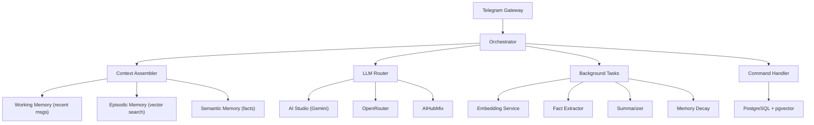

# Remember Bot — Implementation Walkthrough

All 5 phases of the implementation plan are now complete. Here's a summary of the full system.

## Architecture Overview

## Phase 1 — Foundation
- FastAPI app with Docker Compose (app + pgvector DB)
- Telegram webhook integration (python-telegram-bot v22)
- Database models: Users, Conversations, Messages, Facts, Embeddings, Summaries
- LLM Router with multi-provider support and fallback chains
- Config-driven task routing via `config.yaml`

## Phase 2 — Memory System
- **Episodic Memory**: Every message is embedded (gemini-embedding-002, 3072 dims) and stored in pgvector for cosine similarity search
- **Semantic Memory**: LLM-driven fact extraction runs as a background task, storing structured facts with tags and superseding logic
- **Context Assembler**: Combines all three memory tiers (working, episodic, semantic) into a single prompt

## Phase 3 — Robustness
- **Token Budget Enforcement**: Context assembler enforces a configurable token limit (default 8000), allocating proportional budgets to each tier and redistributing unused budget
- **Conversation Summarization**: When unsummarized message count exceeds threshold (50), generates LLM summaries with embeddings

## Phase 4 — Commands & Polish
- `/facts` — List all stored facts with IDs and tags
- `/search <query>` — Keyword + tag search across facts
- `/forget <id|all>` — Soft-delete specific or all facts
- `/model` — Show current AI model config per task
- `/stats` — Memory statistics (messages, facts, embeddings, budget)
- `/help` — Command reference

## Phase 5 — Advanced Features
- **Voice Messages**: Telegram voice/audio → download → base64 → Gemini multimodal API → response
- **Image Understanding**: Telegram photos → download highest res → base64 → Gemini vision → response
- **Memory Decay**: Configurable half-life decay (0.95 factor, 24h min age, 0.1 threshold). Runs every 50 messages. Facts below threshold are auto-deactivated.

## Files Created/Modified

| File | Purpose |
|---|---|
| `src/main.py` | App entry point, DI wiring |
| `src/config.py` | Config classes (LLM, Memory, Bot, Decay) |
| `config.yaml` | All runtime configuration |
| `src/core/orchestrator.py` | Message pipeline, background tasks |
| `src/core/context_assembler.py` | Budget-based context assembly |
| `src/core/fact_extractor.py` | LLM-driven fact extraction |
| `src/core/commands.py` | Command business logic |
| `src/gateway/base.py` | Abstract gateway + IncomingMessage |
| `src/gateway/telegram.py` | Telegram webhook + handlers |
| `src/llm/provider.py` | OpenAI-compat provider (text + multimodal) |
| `src/llm/router.py` | Task routing with fallback chains |
| `src/llm/embeddings.py` | Embedding service |
| `src/memory/episodic.py` | Vector similarity recall |
| `src/memory/semantic.py` | Fact retrieval |
| `src/memory/summarizer.py` | Conversation compression |
| `src/memory/decay.py` | Relevance score decay |
| `src/db/models.py` | SQLAlchemy models (pgvector) |
| `src/db/engine.py` | Async engine + session factory |
| `src/db/repositories/` | Users, Messages, Facts, Embeddings |
| `src/utils/tokens.py` | tiktoken-based token counting |

## Testing
- All phases verified via `docker compose up --build`
- Clean startup logs, no errors
- Embeddings, fact extraction, and commands all confirmed working via Telegram
